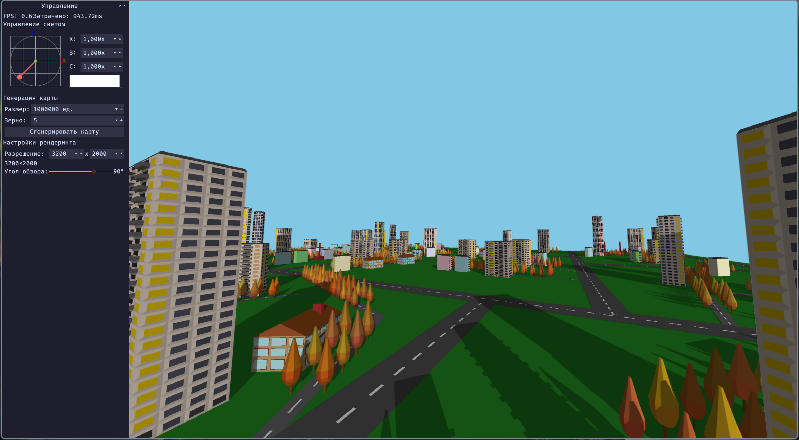
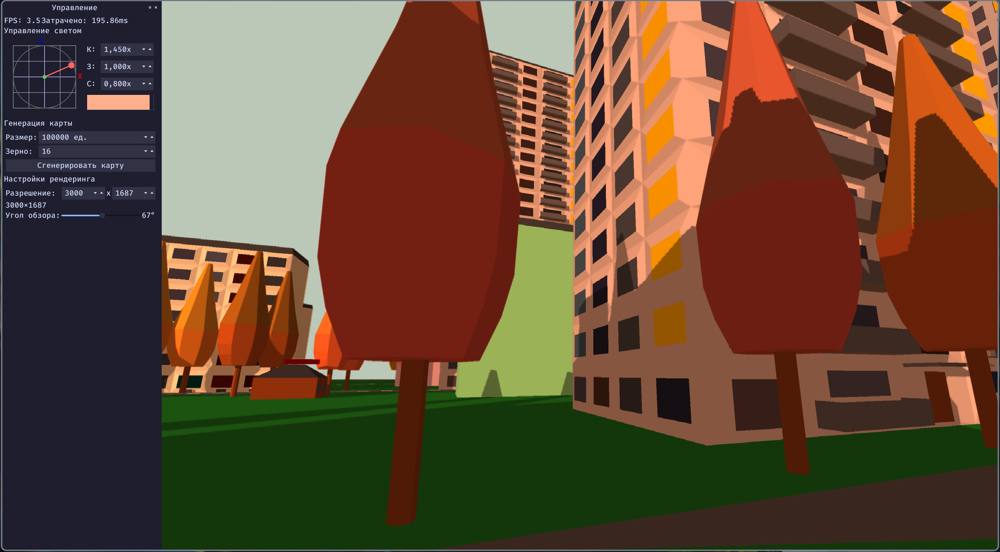

# Процедурная генерация и визуализация городской среды

Курсовой проект по компьютерной графике: генератор городской среды и программный 3D-рендерер на C++/Qt.

Идея проекта простая: сгенерировать город из дорог, кварталов, зданий и деревьев, а затем отрисовать его без готового 3D-движка. Внутри есть свой Z-буфер, растеризация треугольников, диффузное освещение и тени через shadow mapping. Снаружи это обычное Qt-приложение, где можно менять параметры генерации, свет, разрешение и летать камерой по сцене.



## Что умеет

- процедурно строит связную дорожную сеть без изолированных участков;
- делит город на кварталы и добавляет внутриквартальные дороги;
- расставляет здания вдоль дорог без взаимных пересечений;
- загружает разные типы зданий из JSON-моделей;
- поддерживает воспроизводимую генерацию по зерну random seed;
- отрисовывает сцену собственным CPU-рендерером;
- использует Z-буфер для удаления невидимых поверхностей;
- считает диффузное освещение по модели Ламберта;
- добавляет тени с помощью карты теней;
- позволяет управлять камерой и параметрами света в реальном времени.

## Как это выглядит

Вид на сгенерированный город сверху:


Тот же рендерер можно использовать для просмотра сцены с уровня улицы:



## Технологии

- C++20
- Qt 6.5 / Qt Widgets
- CMake
- OpenMP для распараллеливания растеризации
- LaTeX для отчета

Проект не использует OpenGL/DirectX/Vulkan для отрисовки городской сцены. Основная графическая часть написана вручную: сцена переводится в набор полигонов, затем рендерер сам проецирует, растеризует и закрашивает треугольники.

## Сборка и запуск

Нужны CMake, компилятор с поддержкой C++20, Qt6 и OpenMP.

```bash
cd program
cmake -S . -B build -DCMAKE_BUILD_TYPE=Release
cmake --build build
./build/RendererGUI
```

Если Qt установлен не в системный путь, передайте путь к нему через `CMAKE_PREFIX_PATH`.

Также в проекте есть `program.pro`, поэтому можно собрать через qmake:

```bash
cd program
qmake6 program.pro
make
./RendererGUI
```

В текущей версии путь к папке с JSON-моделями зданий задан в [program/MainWindow.cpp](program/MainWindow.cpp) абсолютным путем. Если проект находится не в `/drive_d/Documents/CG_curs`, перед запуском нужно заменить путь на свой или сделать его относительным:

```cpp
City::SmartBuildingSelector("/drive_d/Documents/CG_curs/program/buildings")
```

## Управление

- `W`, `A`, `S`, `D` - перемещение камеры;
- `Shift` - ускорение движения;
- зажатая левая кнопка мыши - поворот камеры;
- колесо мыши и панель управления - настройка просмотра и параметров сцены.

Через боковую панель можно менять направление и цвет света, размер карты, зерно генерации, разрешение рендера и угол обзора камеры.

## Структура проекта

```text
program/
  renderer/              программный рендерер, буферы, свет, камера
  city/                  генерация дорог, кварталов и размещение зданий
  buildings/             JSON-модели зданий
  generation_buildings/  скрипты для генерации моделей зданий
  MainWindow.*           Qt-интерфейс и связка генерации с рендером

report/
  src/                   исходники расчетно-пояснительной записки
  preza/                 изображения, схемы и материалы презентации

ready/                   готовые PDF отчета и презентации
```

## Материалы

- [Готовый отчет](ready/ИУ7-56Б-Саватеев-Михаил-КуР-КГ-РПЗ.pdf)
- [Готовая презентация](ready/ИУ7-56Б-Саватеев-Михаил-КуР-КГ-През.pdf)

## Немного о реализации

Город хранится отдельно от графической сцены. Сначала модуль генерации строит карту: внешние дороги задают границы кварталов, внутренние дороги проходят внутри кварталов, а селектор зданий подбирает подходящие модели из каталога `program/buildings`. После этого город экспортируется в набор графических объектов, понятный рендереру.

Рендерер работает с треугольными полигонами. Для каждого кадра он применяет преобразования камеры, проецирует вершины на экран, растеризует треугольники и сравнивает глубину фрагментов через Z-буфер. Для теней сцена дополнительно рендерится с точки зрения источника света, а затем основной проход проверяет, находится ли фрагмент в тени.

В исследовательской части отчета отдельно измерялась зависимость времени отрисовки от размера кадра. Результат ожидаемый для такого подхода: при квадратном изображении время кадра растет примерно квадратично относительно длины стороны.
